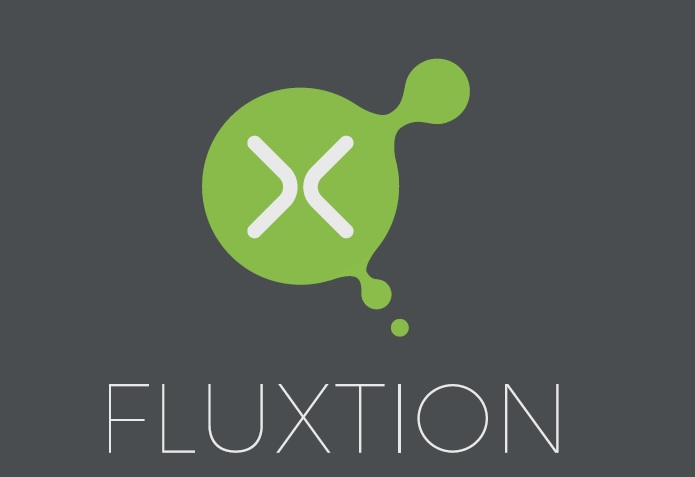

# Introduction

## Overview

Thanks for dropping by, hope we can persuade you to donate your time to investigate Fluxtion further.

Fluxtion is a code generator that automates the production of event stream processing logic. Our goal is to automate the development process, increasing both developer efficiency and code correctness for streaming applications. We make complex problems easy to solve. Creating and optimising complex processing graphs is the main goal of Fluxtion.

The generated code is self-contained and designed to sit within an application, an application delivers events to the Fluxtion generated Static Event Processor for stream processing. 

Low latency, easy maintenance, zero gc, complex graph processing, simplified development and the "wow you can do that!!" reaction are the principles that guide our project.

As a stretch goal we would like to be the [fastest single threaded java stream processor](https://github.com/v12technology/fluxtion-quickstart/blob/master/README.md#run) on the planet.

## What are we solving

Fluxtion automates the process of developing event processing algorithms. Writing complex behavioural conditional logic is hard and error prone. Streaming applications that handle multiple events and require intricate execution logic soon overwhelm the developer with complexity. The burden of creating complicated calculation graphs is delegated to Fluxtion empowering developers to tackle high value projects without risk. We want to make business logic cheaper to deliver, more reliable and easier to maintain.

Fluxtion is focused on optimising the implementation of stream processing graphs. A generated Fluxtion event processor is fed a stream of application events, processes them and delivers the desired results. Possible uses include: realtime market manipulation monitoring, optimised scoring ML model, CSV parser processing a byte stream, ETL, data-prep, Iot montioring with conditional execution.

Want to upgrade your application logic without rewriting your infrastructure? Fluxtion is the perfect solution for you.

## Unique approach

Fluxtion is unique among stream processors as there is no need for a Fluxtion server at runtime. Our code generated solutions remove the unnecessary cost, complication and inefficiencies required to integrate a streaming server into your application. 

Other stream processors support marshalling, distributed processing, event distribution, gui's and a multitude of other features. Fluxtion presumes there is an event queue that will feed it, and concentrates solely on delivering correct and optimal execution of application logic. 

In general we try to promote [zero cost abstractions](http://matthewfl.com/2114/programming/cost-of-abstractions) in Java using a [metaprogramming ](https://en.wikipedia.org/wiki/Metaprogramming)approach. Other languages such as C++ and Rust use zero cost abstraction as a means to achieving high performance. Fluxtion brings this paradigm to Java stream processing applications. We use static analysis to create a meta-model of the calculation dependencies that in turn drives our generated solutions.

Maintenance is the most expensive cost of any system, we believe by generating code, png's, graphML and injecting monitoring points maintenance costs are reduced. Our philosophy is to help a business reduce maintenance by offering visual and documentary insight into the actual business logic.

Please check out our [vision](https://github.com/v12technology/fluxtion/blob/master/VISION.md) for more discussion about where we see Fluxtion's place in the world.

