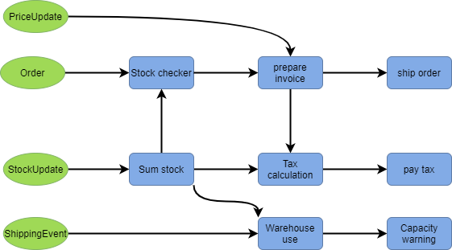

# Introduction 2

If you are interested in writing real-time or streaming applications we hope to persuade you to investigate Fluxtion further.

Fluxtion is a  routing utility for use within a stream processing application, automatically connecting event streams to processing pipelines. The application is statically analysed by Fluxtion to create an embedded router. With this approach complex real-time applications can be built more quickly, with less bugs and the end result is optimized for performance to reduce running costs. 

### The what, how and when for stream processing

When building a stream processing application the developer has to answer three questions:

| Question | Answer |
| :--- | :--- |
| **WHAT**  requires processing? | Event streams are the input source to the application  |
| **HOW**  does the input need processing? | Custom written logic or library functions |
| **WHEN** does the processing take place? | Bespoke dispatch logic that connects events to functions |

Fluxtion is the automatic generation of the **WHEN** logic in a streaming application. Looking at the example diagram below Fluxtion acts as the arrows connecting components:



When a specific event is received only connected components are executed and always in the [correct predictable order](https://www.geeksforgeeks.org/topological-sorting/). The generated dispatcher is a highly optimized graph processing engine for embedding in the host application.

### Why is this useful

Projects and components exist that help developers answer the what and the how questions in a streaming application. Kafka for example supplies a reliable event stream, this is **what** we process. Many utilities exist for re-use to meet application calculation requirements, this is **how** we process. 

Fluxtion is the missing piece in the puzzle. As an application develops over time the way we connect components changes and evolves requiring constant re-working. Manually coded dispatch logic become more fragile and increasingly complex. This leads to many bugs and time consuming maintenance, Fluxtion static analysis algorithms remove these time and money drains from the development cycle. Dispatch logic or **when** to connect components is generated automatically.  

### Birdseye technical view

Fluxtion is a java utility that generates complex dispatch logic. Conceptually Fluxtion operates like a hybrid of java streams, RX java and google guava event bus. Each incoming event requires a unique execution path, those paths may combine for different events and each path is reactive.  The generated dispatcher is a bespoke graph processing engines specifically tailored for the application.

### 5 minute example

The example below monitors a stadium for TurnstyleIn and TurnstyleOut events, controlling the entrances and exits based on the number of people in the stadium.   

```java
public class StadiumMonitorBuilder {

    @SepBuilder(name = "TurnstyleProcessor", 
    packageName = "com.fluxtion.blogs.turnstlye")
    public void build(SEPConfig cfg) {
        var stadiumController = new StadiumController(); 
        //the id allows the count to be accessed by a well known name for logging
        var fanCount = subtract(count(TurnStyleIn.class), count(TurnStyleOut.class)).id("fanCount");
        // >50 slow entrance 
        //the notifyOnChnage stops log spamming - only notfies on first breach
        fanCount.filter(gt(50)).notifyOnChange(true)
            .push(stadiumController::slowEntry);
        // >60 close entrances  
        fanCount.filter(gt(60)).notifyOnChange(true)
            .push(stadiumController::closeAllEntrances);
        // >70 evacuate 
        fanCount.filter(gt(70)).notifyOnChange(true)
            .push(stadiumController::evacuate);
    }

    public static class TurnStyleIn {}

    public static class TurnStyleOut {}


    public static class StadiumController {

        public void slowEntry(int count) {
            System.out.println(
            "SLOWING ENTRY by closing some entrances high capacity:"+ count);
        }

        public void closeAllEntrances(int count) {
            System.out.println(
            "CLOSING ALL ENTRANCES over safe capacity:" + count);
        }

        public void evacuate(int count) {
            System.out.println(
            "EVACUATE NOW, stadium dangerous capacity:"+ count);
        }
    }
}
```

The following logic is applied:

* Estimate the number of fans in the stadium = count\(in\) - count\(out\) 
* Control the stadium with an instance of StadiumController
* if fan count &gt; 50 invoke StadiumController.slowEntry\(\)
* if fan count &gt; 60 invoke StadiumController.closeAllEntrances\(\)
* if fan count &gt; 70 invoke StadiumController.evacuate\(\)
* Only call the methods on a breach to prevent log spamming

