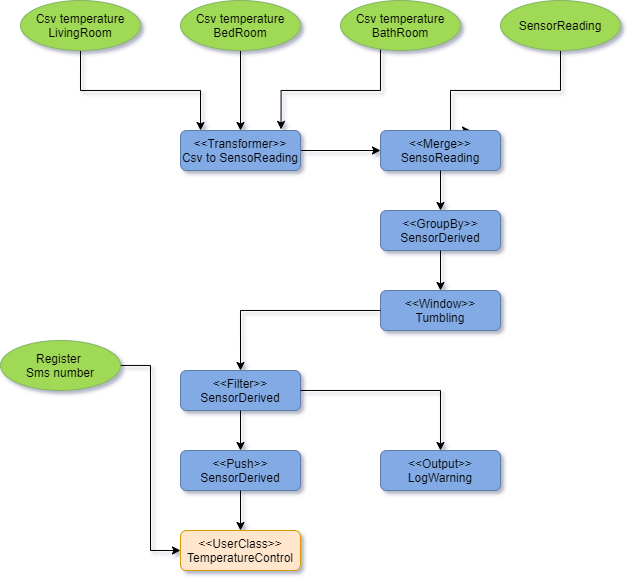

# Quick start

## Introduction

5 Minute tutorial to demonstrate stream data processing using Fluxtion. The goal is to read a sensor data stream for a set of rooms, calculate aggregate values per room and notify a user class when a room breaches set temperature criteria. The user class will send an SMS alert when notified, if a number has been registered.

To get benefit out of this tutorial you should have:

* A passing understanding of[ stream processing](https://dzone.com/articles/what-is-stream-processing-a-gentle-introduction)
* Intermediate Java coding skills combined with basic knowledge of git and maven

## Requirements

* Read room sensor temperature as a stream of csv records or as instances of SensorReading events. 
* Merge csv records and SensorReading instances into a single event stream for processing
* The event stream can be infinite
* For each room calculate the max and average temperature
* Run a tumbling window, zeroing all room values every 3 readings
* Register a user class with the stream processor to act as a controller of an external system
* If a room has an average of &gt; 60 and max of &gt; 90 then
  * Log a warning
  * A user class\(TempertureController\) will attempt to send an SMS listing rooms to investigate
* Register an SMS endpoint with the controller by sending a String as an event into the processor
* The SMS number can be updated in realtime



## Running the application

Clone the [quickstart project](https://github.com/v12technology/fluxtion-quickstart) and execute the sensorquickstart.jar in the dist directory, as shown below:

```text
git clone https://github.com/v12technology/fluxtion-quickstart.git
cd fluxtion-quickstart
java  -Dfluxtion.cacheDirectory=fluxtion -jar dist\sensorquickstart.jar
21:40:45.991 [main] INFO  c.f.generator.compiler.SepCompiler - generated sep: C:\quickstart\fluxtion\source\com\fluxtion\quickstart\roomsensor\generated\RoomSensorSEP.java
 ->     bathroom:45
 ->     living:78
 ->     bed:43
readings in window : [(bathroom  max:45 average:45.0), (living  max:78 average:78.0), (bed  max:43 average:43.0)]
 ->     bed:23
 ->     bathroom:19
 ->     bed:34
readings in window : [(bed  max:34 average:28.5), (bathroom  max:19 average:19.0)]
 ->     living:89
 ->     bed:23
 ->     living:44
readings in window : [(living  max:89 average:66.5), (bed  max:23 average:23.0)]
 ->     living:36
 ->     living:99
 ->     living:56
readings in window : [(living  max:99 average:63.666666666666664)]
**** WARNING **** sensors to investigate:[living]
NO SMS details registered, controller impotent
Temp controller registering sms details:0800-1-HELP-ROOMTEMP
 ->     living:36
 ->     living:99
 ->     living:56
readings in window : [(living  max:99 average:63.666666666666664)]
**** WARNING **** sensors to investigate:[living]
SMS:0800-1-HELP-ROOMTEMP investigate:[living]
```

The application processes the file [temperatureData.csv](https://github.com/v12technology/fluxtion-quickstart/blob/1.0.0/temperatureData.csv) as an input in place of real sensor source. The last three records trigger an alert condition. No SMS endoint is registered so the controller is unable to send a message.

After reading the csv file SensorReading events are programatically sent to the processor, to register an SMS number and create an alert condition. In this case the controller can now send an SMS message.

The environmental variable **fluxtion.cacheDIrectory** sets the cache directory for outputs of the fluxtion compiler. Executing a second time sees a significant reduction in processing time as the classes in the cache directory are used and no compilation of the stream processor is required. Deleting the cache directory will force the application to recompile at the next start.

## Solution description

### Dependencies



```markup
<dependency>
  <groupId>com.fluxtion.extension</groupId>
  <artifactId>fluxtion-text-builder</artifactId>
  <version>2.5.1</version>
</dependency>
```



```groovy
implementation 'com.fluxtion.extension:fluxtion-text-builder:2.5.1'
```



### Build a processor and stream events

The code below is from [SensorMonitor](https://github.com/v12technology/fluxtion-quickstart/blob/master/src/main/java/com/fluxtion/quickstart/roomsensor/SensorMonitor.java) builds a streaming processing engine and sends events to it.

```java
 public static void main(String[] args) throws Exception {
     StaticEventProcessor processor = reuseOrBuild("RoomSensorSEP",
             "com.fluxtion.quickstart.roomsensor.generated",
             SensorMonitor::buildSensorProcessor);
     CharStreamer.stream(new File("temperatureData.csv"), processor)
             .sync().stream();
     processor.onEvent("0800-1-HELP-ROOMTEMP");
     processor.onEvent(new SensorReading("living", 36));
     processor.onEvent(new SensorReading("living", 99));
     processor.onEvent(new SensorReading("living", 56));
 }

 @SuppressWarnings({"unchecked", "varargs"})
 public static void buildSensorProcessor(SEPConfig cfg) {
     //merge csv marshller and SensorReading instance events
     Wrapper<SensorReading> sensorData = merge(select(SensorReading.class),
             csvMarshaller(SensorReading.class).build()).console(" -> \t");
     //group by sensor and calculate max, average
     GroupBy<SensorReadingDerived> sensors = groupBy(sensorData, 
             SensorReading::getSensorName, SensorReadingDerived.class)
             .init(SensorReading::getSensorName, SensorReadingDerived::setSensorName)
             .max(SensorReading::getValue, SensorReadingDerived::setMax)
             .avg(SensorReading::getValue, SensorReadingDerived::setAverage)
             .build();
     //tumble window (count=3), warning if avg > 60 && max > 90 in the window for a sensor
     tumble(sensors, 3).console("readings in window : ", GroupBy::collection)
             .map(SensorMonitor::warningSensors, GroupBy::collection)
             .filter(c -> c.size() > 0)
             .console("**** WARNING **** sensors to investigate:")
             .push(new TempertureController()::investigateSensors);
 }
```

A method reference is passed to the  [reuseOrBuild](https://github.com/v12technology/fluxtion/blob/a15f9bc6e28ed7071be16795d6813724454b8f11/generator/src/main/java/com/fluxtion/generator/compiler/InprocessSepCompiler.java#L158) function on line 2 to build the graph. The two string parameters are used as the fully qualified name of the generated stream processing class. The call to reuseOrBuild checks the classpath for a class that matches the fully qualified name. If no class can be loaded for that fqn, then a new stream processor is generated.

#### Processing events

Once built the application can send CharEvent's from a file to the generated [StaticEventProcessor ](https://github.com/v12technology/fluxtion/blob/2.5.1/api/src/main/java/com/fluxtion/api/StaticEventProcessor.java)using the utility method CharStreamer,stream\(\) on line 5 or programmatically via the onEvent method on line 7. The processor will dispatch events within the execution graph to the correct instance.

#### Defining the calculation

The builder method constructs the processor on lines 14-31. Method references are used throughout to increase type safety, make refactoring easier and make ide's more productive in building event processors.

### Integrated user classes

The builder refers to two helper instances that define the input and output datatypes. Lombok is used to reduce boilerplate code for getter/setters.

```java
@Data
@AllArgsConstructor
@NoArgsConstructor
public static class SensorReading {

    private String sensorName;
    private int value;

    @Override
    public String toString() {
        return sensorName + ":" + value;
    }
}

@Data
public static class SensorReadingDerived {

    private String sensorName;
    private int max;
    private double average;

    @Override
    public String toString() {
        return "(" + sensorName + "  max:" + max + " average:" + average + ")";
    }
}
```

A user supplied mapping function converts the aggregated sensor data for all rooms and creates a collection of room names that require investigation:

```java
public static Collection<String> warningSensors(Collection<SensorReadingDerived> readings) {
    return readings.stream()
            .filter(s -> s.getMax() > 90).filter(s -> s.getAverage() > 60)
            .map(SensorReadingDerived::getSensorName)
            .collect(Collectors.toList());
}
```

A user supplied controller instance is registered with the stream processor. When the list of rooms to investigate is &gt; 0, the list is pushed to the user controller class.

To register an SMS endpoint the controller class annotates a method to receive a String as an event. The processor will route any String to the controller class method.

```java
public static class TempertureController {

    private String smsDetails;

    public void investigateSensors(Collection<String> sensors) {
        if (smsDetails == null) {
            System.out.println("NO SMS details registered, controller impotent");
        } else {
            System.out.println("SMS:" + smsDetails + " investigate:" + sensors);
        }
    }

    @EventHandler
    public void setSmsDetails(String details) {
        System.out.println("Temp controller registering sms details:" + details);
        this.smsDetails = details;
    }
}
```

## Cached compilation

The application generates a solution in a cache directory, set with system property:

**-Dfluxtion.cacheDirectory=fluxtion**

The fluxtion cache directory contains three sub-directories:

* classes - compiled classes generated by the Fluxtion compiler
* resources - meta-data describing the processor
* sources - The java source files used to generate the classes 

The classes directory is added to the classpath by the [reuseOrBuild](https://github.com/v12technology/fluxtion/blob/a15f9bc6e28ed7071be16795d6813724454b8f11/generator/src/main/java/com/fluxtion/generator/compiler/InprocessSepCompiler.java#L158) method. If an event processor cannot be loaded with the fqn supplied then the classes generated by the ahead of time compiler are written to the classes directory.

Executing the jar a second time sees a significant reduction in execution time as the application loads the compiled processor from the first run. Using the cached compiled classes gives an almost instant response to the input event stream.

Deleting the cache directory will cause the regeneration and compilation of the solution.

### Generated files

* source - A CSV marshaller and stream processing solution are generated here. 
  * The main entry point to the stream processor is RoomSensorSEP.java
  * The CVS marshaller is SensorReadingCsvDecoder0.java
* classes - The sources are compiled in this directory, ready for subsequent executions
* resources - Description of the generated process graph for rendering and non class resources required at runtime
  * An [image](https://github.com/v12technology/fluxtion-quickstart/blob/1.0.0/src/main/resources/com/fluxtion/quickstart/roomsensor/generated/RoomSensorSEP.png) describing the processing graph 
  * A [graphml](https://github.com/v12technology/fluxtion-quickstart/blob/1.0.0/src/main/resources/com/fluxtion/quickstart/roomsensor/generated/RoomSensorSEP.graphml) that can be interactively explored with a [netbeans plugin](http://plugins.netbeans.org/plugin/75197/fluxtion-graphml)
  * Any user lambdas used in the processor are serialised for loading in the generated processor

