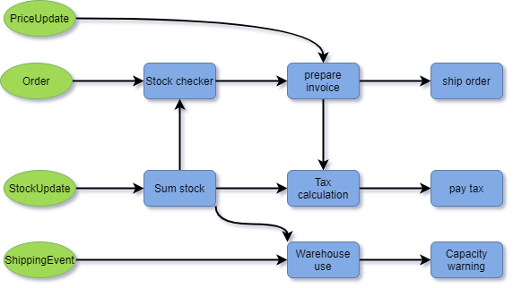

# Introduction 2

If you are interested in writing real-time or streaming applications we hope to persuade you to investigate Fluxtion further.

Fluxtion is a  routing utility for use within a stream processing application, automatically connecting event streams to processing pipelines. The application is statically analysed by Fluxtion to create an embedded router. With this approach complex real-time applications can be built more quickly, with less bugs and the end result is optimized for performance to reduce running costs. 

When building an event streaming processing a developer has to answer three questions:

| Question | Answer |
| :--- | :--- |
| **WHAT**  requires processing? | Event streams are the input source to the application  |
| **HOW**  does the input need processing? | Custom written logic or re-used functions |
| **WHEN** does the processing take place? | Bespoke dispatch logic that connects events to streams |

Fluxtion is the automatic generation of the **WHEN** logic in a streaming application. 

For the example below Fluxtion is the arrows in the diagram:

Components are re-used for the other two questions, Fluxtion is the missing piece in the puzzle.

