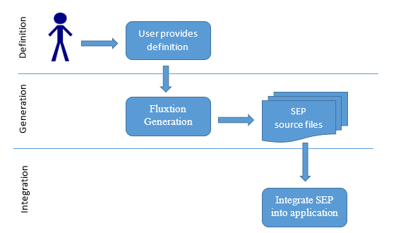

# Developer workflow

## Introduction

Creating a Static Event processor involves three distinct phases for a developer:

1. Definition - User supplied configuration to Fluxtion.
2. Generation - Fluxtion processes the configuration and applies processing inference to generate a static event processor \(SEP\).
3. Integration – Integrate the generated SEP into a user application or library.

      An example of the steps covered is in the [quick start](../untitled.md) example.

## Maven integration

Fluxtion integrates with the standard maven workflow, we offer two maven integration methods:

* Fluxtion maven plugin
* Programmatic generation

### Fluxtion maven plugin

The steps a developer should follow to execute the Fluxtion event stream compiler via a maven plugin as part of the standard workflow are:

#### setup

* Create a[ maven project ](../tools/maven-plugin.md#fluxtion-dependencies)declaring Fluxtion libraries as dependencies.
* Add the [fluxtion maven plugin](../tools/maven-plugin.md#add-build-plugins) to the build plugins, setting configuration.

#### definition

* Write application classes representing nodes and events to fulfill [event processing](https://fluxtion.gitbook.io/docs/overview/child-2) requirement.
* Create meta-data describing the [construction of the execution graph](https://fluxtion.gitbook.io/docs/overview/graph-building-primitives).

#### generation

* Run a mvn [build](../tools/maven-plugin.md#run-build).

#### integration

* Integrate the generated SEP into the [application](../untitled.md#step-4-integrate-sep).

### Programmatic generation


EXPERIMENTAL FEATURE, multiple classloaders are used by Fluxtion, testing is required


Building a SEP using the tools provided \(mvn plugin or cli\) maybe inconvenient as this requires more upfront development effort. Fluxtion provides a library for building a SEP [programmatically ](https://github.com/v12technology/fluxtion/blob/master/generator/src/main/java/com/fluxtion/generator/compiler/InprocessSepCompiler.java)in the current process. The library generates code and classes as the out of process solutions. The SEP artifacts generated in process are transient and will not persist between startups, unless the generated sources are copied into the source base and compiled.

#### Maven classpath

A BOM is provided that simplifies selecting compatible versions of Fluxtion libraries. The Fluxtion BOM sets the scope of libraries as follows:

| library | maven scope |
| :--- | :--- |
| api | compile |
| builder | provided |
| generator | provided |


Simple appraoch, use a maven test to generate programmaically. Enable test when new generation is required.


Provided dependencies are not included as transitive maven dependencies, they can be accessed during compilation. To use in process building all libraries must be on the class path, we can achieve this in two ways leveraging maven functionality:

* **Generate in test scope** - test classes have access to provided artifacts, allowing programmatic generation.
* **Override maven scope** - set all Fluxtion dependencies as compile scope. Generate as part of the execution of the application.

#### Developer process

The developer process is the same as that set out previously, except for a few small changes.

#### setup

* Create a[ maven project ](../tools/maven-plugin.md#fluxtion-dependencies)declaring Fluxtion libraries as dependencies.

#### definition

* Write application classes representing nodes and events to fulfill [event processing](https://fluxtion.gitbook.io/docs/overview/child-2) requirement.
* Create meta-data describing the [construction of the execution graph](https://fluxtion.gitbook.io/docs/overview/graph-building-primitives).

#### generation

* Write [programmtic ](https://github.com/v12technology/fluxtion/blob/master/generator/src/test/java/com/fluxtion/compiler/InprocessSepCompilerTest.java)definition in a test, specifying the output directories.
* Run a mvn [build](../tools/maven-plugin.md#run-build).

#### integration

* Integrate the generated SEP into the [application](../untitled.md#step-4-integrate-sep).

