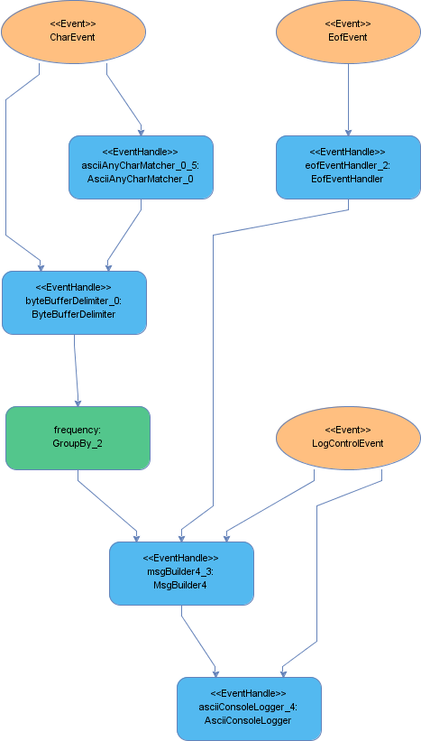

# Structured processing

## Introduction

A SEP formalises the processing of application events into a predictable form. Adhoc dispatch logic is prevented from happening, we name this concept **structured processing.** Similar to [structured data](https://whatis.techtarget.com/definition/structured-data) the formal nature of structured processing permits a set of tools to be created that support the analysis of the execution logic. 

As well as tools, humans can draw inferences from meta-data outputs that are generated by Fluxtion. As there is an understanding how the SEP will implement the processing logic an image of the SEP graph could allow an analyst to quickly validate the processing logic. 

## Processing description outputs

At the same time as the ESC generates a SEP, a set of artifacts are produced that are consistent and reconciled with the code. These non-code outputs can be used to aid understanding of the logical processing. The outputs are:

### GraphML

a markup description of the execution graph encoded in the SEP. The markup  details all nodes, class types, references between nodes, event handler nodes and input events. Attributes on the nodes include:

* The class of the node
* The type of node, event handler or child node
* The class of the Event
* The variable name of the node generated in the code
* The event types feeding into an event handler

Fluxtion provides a visual analyser tool that can load the graphML and provide interactive analysis capabilities.

### Png of static event processor

An image is generated from the graphML that represents the execution graph the SEP implements.



#### Key:

* Orange ovals - Event
* Blue rectangles - Event handler
* Green rectangle - Node

### Sample graphML 

```markup
<?xml version="1.0" encoding="UTF-8"?><graphml xmlns="http://graphml.graphdrawing.org/xmlns" xsi:schemaLocation="http://graphml.graphdrawing.org/xmlns http://graphml.graphdrawing.org/xmlns/1.0/graphml.xsd" xmlns:jGraph="http://www.jgraph.com/" xmlns:xsi="http://www.w3.org/2001/XMLSchema-instance">
    <key id="vertex_label" for="node" attr.name="nodeData" attr.type="string"/>
    <key id="edge_label" for="edge" attr.name="edgeData" attr.type="string"/>
    <graph edgedefault="directed">
        <node id="dirtyNode_5">
            <data key="vertex_label">
                <jGraph:ShapeNode>
                    <jGraph:Geometry height="70" width="160" x="20" y="20"/>
                    <jGraph:label text="dirtyNode_5:&#10;DirtyNode"/>
                    <jGraph:Style properties="NODE"/>
                </jGraph:ShapeNode>
            </data>
        </node>
        <node id="dataEventHandler_1">
            <data key="vertex_label">
                <jGraph:ShapeNode>
                    <jGraph:Geometry height="70" width="160" x="20" y="20"/>
                    <jGraph:label text="&lt;&lt;EventHandle&gt;&gt;&#10;dataEventHandler_1:&#10;DataEventHandler"/>
                    <jGraph:Style properties="EVENTHANDLER"/>
                </jGraph:ShapeNode>
            </data>
        </node>
        <node id="dirtyNode_7">
            <data key="vertex_label">
                <jGraph:ShapeNode>
                    <jGraph:Geometry height="70" width="160" x="20" y="20"/>
                    <jGraph:label text="dirtyNode_7:&#10;DirtyNode"/>
                    <jGraph:Style properties="NODE"/>
                </jGraph:ShapeNode>
            </data>
        </node>
        <node id="DataEvent">
            <data key="vertex_label">
                <jGraph:ShapeNode>
                    <jGraph:Geometry height="70" width="160" x="20" y="20"/>
                    <jGraph:label text="&lt;&lt;Event&gt;&gt;&#10;DataEvent"/>
                    <jGraph:Style properties="EVENT"/>
                </jGraph:ShapeNode>
            </data>
        </node>
        <edge id="1" source="dataEventHandler_1" target="dirtyNode_5">
            <data key="edge_label">
                <jGraph:ShapeEdge/>
            </data>
        </edge>
        <edge id="2" source="dataEventHandler_1" target="dirtyNode_7">
            <data key="edge_label">
                <jGraph:ShapeEdge/>
            </data>
        </edge>
        <edge id="3" source="myEventHandler_3" target="dirtyNode_9">
            <data key="edge_label">
                <jGraph:ShapeEdge/>
            </data>
        </edge>
        <edge id="4" source="dirtyNode_9" target="dirtyAggregator_11">
            <data key="edge_label">
                <jGraph:ShapeEdge/>
            </data>
        </edge>

//elements omitted 

    </graph>
</graphml>

```

## Processing integration

When the SEP is generated Fluxtion can inject integration points into the code. These injection points allow an [Auditor ](https://github.com/v12technology/fluxtion/blob/master/api/src/main/java/com/fluxtion/runtime/audit/Auditor.java)to be integrated into the processing loop post the generation process. An Auditor receives callbacks for each event processed and each node that is invoked. Using these injection points an auditor can be used to perform a host of functions such as:

* Logging of all events and nodes invocations in the execution path order.
* A performance monitor.
* A dynamic property tracer.

The capabilities of auditing are covered in the [auditing ](../auditing.md)section.

